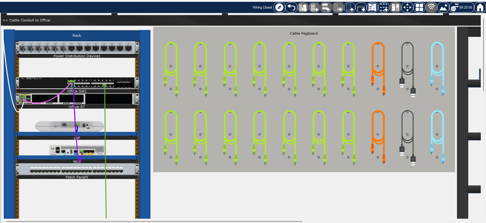
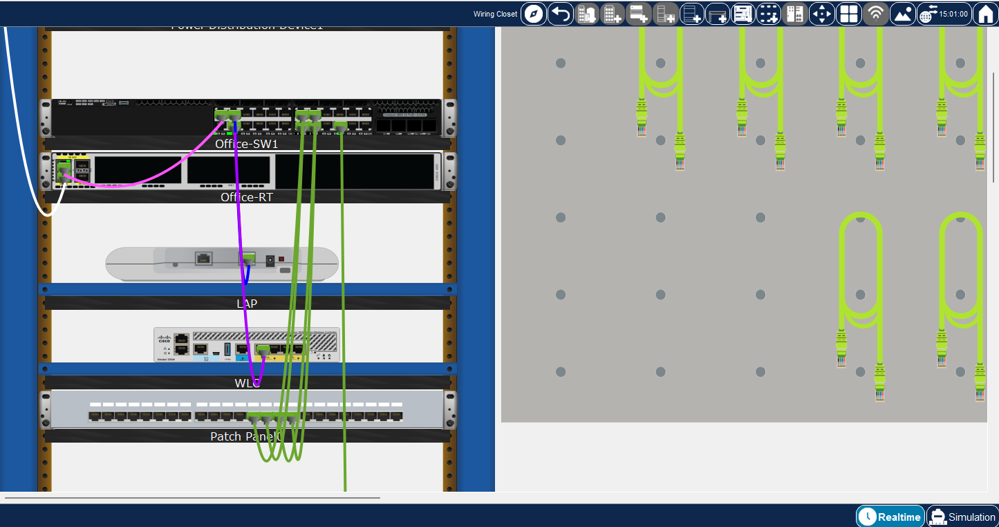
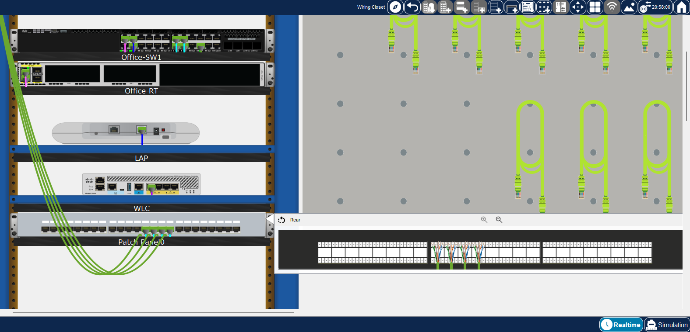
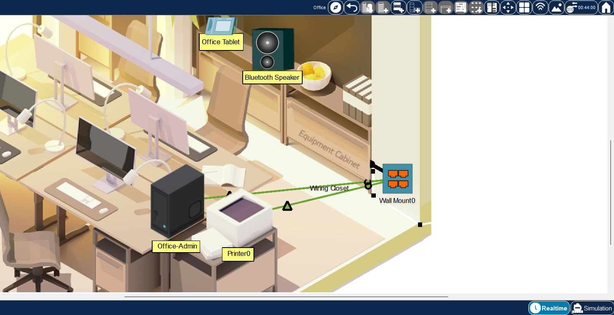
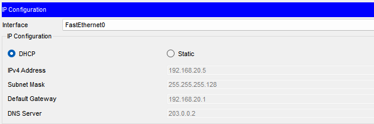
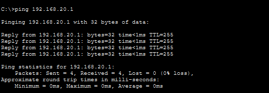
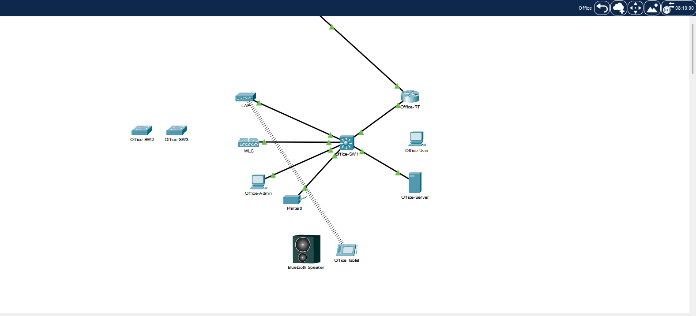
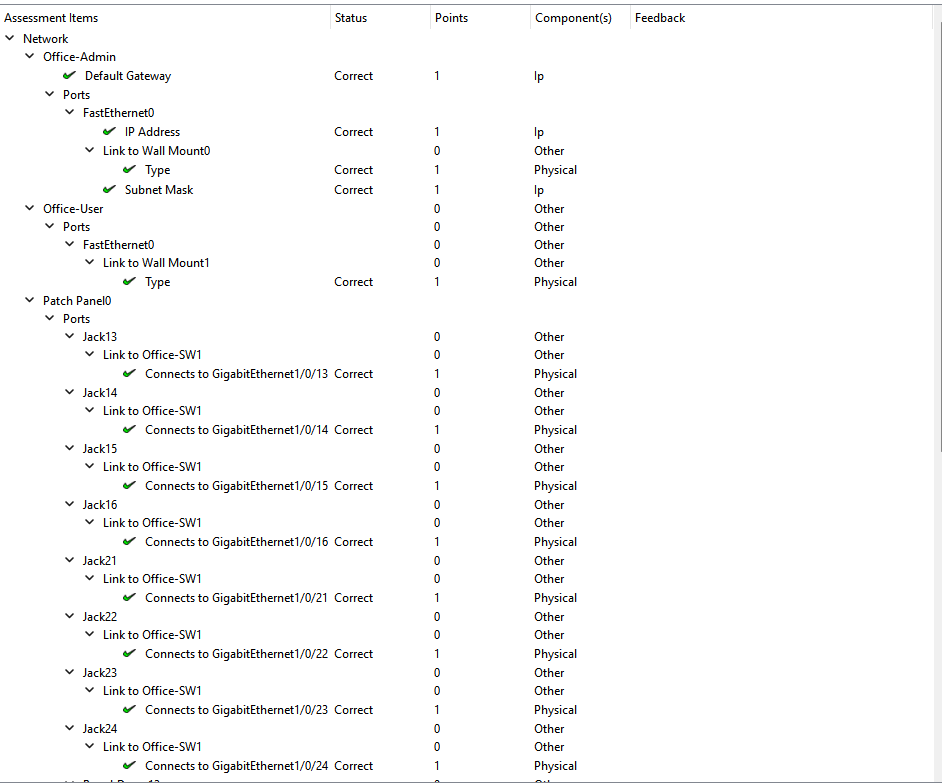

# Lab 001 – Realistic Structured Cabling in Cisco Packet Tracer

## Overview

In this lab, I created a realistic structured cabling environment using the Physical Workspace in Cisco Packet Tracer.

The activity simulated the installation of network infrastructure inside an office environment. This included installing a rack-mounted patch panel, connecting switch interfaces to patch-panel ports, installing wall-mounted network outlets, terminating horizontal cabling, connecting office endpoints, and organizing physical cable runs.

After completing the physical infrastructure, I verified network connectivity using DHCP-assigned IPv4 information and ICMP testing.

During verification, I also encountered a DNS connectivity issue. Troubleshooting the issue provided additional experience isolating a network problem by testing connectivity at different points in the communication path.

---

## Objectives

- Install a copper patch panel inside a network rack.
- Connect switch interfaces to corresponding patch-panel jacks.
- Install wall-mounted Ethernet outlets.
- Connect wall-mount punchdowns to the patch panel.
- Connect office endpoints using copper straight-through cables.
- Organize physical cable paths using bend points.
- Understand the relationship between wall jacks, patch panels, and switches.
- Verify DHCP-assigned IPv4 configuration.
- Test connectivity to the default gateway.
- Troubleshoot DNS and upstream connectivity.
- Compare physical and logical network topology.
- Verify the completed configuration using Packet Tracer's assessment system.

---

## Business Scenario

A small business office requires structured network cabling to provide reliable wired connectivity for employee workstations, printers, and other network devices.

Instead of running long Ethernet cables directly from each endpoint to the network switch, the organization uses a structured cabling system.

The connection path follows:

```text
Endpoint
   |
   v
Wall Jack
   |
   v
Horizontal Cabling
   |
   v
Patch Panel
   |
   v
Patch Cable
   |
   v
Network Switch
```

This type of design makes the network easier to organize, maintain, expand, and troubleshoot.

In this lab, the existing office network was expanded by installing `Patch Panel0`, `Wall Mount0`, and `Wall Mount1` and connecting several office endpoints to the network through the new structured cabling infrastructure.

---

## Lab Environment

| Component | Role |
|---|---|
| Cisco Packet Tracer | Network simulation platform |
| Physical Workspace | Simulated office and wiring closet |
| Logical Workspace | Logical network topology |
| Office-SW1 | Primary office network switch |
| Office-RT | Office router/default gateway |
| Patch Panel0 | Central termination point for office cabling |
| Wall Mount0 | Network outlets for Office-Admin and Printer0 |
| Wall Mount1 | Network outlet for Office-User |
| Office-Admin | Administrative workstation |
| Office-User | User workstation |
| Printer0 | Network printer |
| Office-Server | Internal office server |

### Network Information Observed

| Setting | Value |
|---|---|
| Office-Admin IPv4 | `192.168.20.5` |
| Subnet Mask | `255.255.255.128` |
| Prefix Length | `/25` |
| Default Gateway | `192.168.20.1` |
| DNS Server | `203.0.0.2` |
| Office-Server IPv4 | `192.168.20.126` |

---

## Technologies Used

- Cisco Packet Tracer
- Cisco switching
- Ethernet
- Copper straight-through cabling
- Structured cabling
- Patch panels
- Wall-mounted network outlets
- RJ-45 Ethernet connections
- Punchdown terminations
- Physical cable management
- IPv4
- DHCP
- DNS
- ICMP
- TCP/IP

---

## Implementation

### Part 1 – Install Patch Panel0

I entered the simulated Wiring Closet through the Equipment Cabinet.

From the structured cabling devices, I selected a Copper Patch Panel and installed it inside the equipment rack.

The patch panel was named:

```text
Patch Panel0
```

The patch panel provides a centralized termination point between the office's permanent horizontal cabling and the network switch.



---

### Part 2 – Connect Office-SW1 to Patch Panel0

I used Copper Straight-Through cables to connect interfaces on `Office-SW1` to corresponding jacks on `Patch Panel0`.

The first four connections were:

| Office-SW1 Interface | Patch Panel0 |
|---|---|
| GigabitEthernet1/0/13 | Jack13 |
| GigabitEthernet1/0/14 | Jack14 |
| GigabitEthernet1/0/15 | Jack15 |
| GigabitEthernet1/0/16 | Jack16 |

These connections represent the patch cables between the network switch and the front of the patch panel.



---

### Part 3 – Install Wall Mount0

I returned to the office and installed a Copper Wall Mount near the Equipment Cabinet.

The wall mount was named:

```text
Wall Mount0
```

Wall Mount0 provides Ethernet outlets that office endpoints can connect to without requiring cables to run directly to the network switch.

---

### Part 4 – Connect Wall Mount0 to Patch Panel0

The rear punchdowns on Wall Mount0 were connected to corresponding punchdowns on Patch Panel0.

The following connections were created:

| Wall Mount0 | Patch Panel0 |
|---|---|
| Punchdown1 | Punchdown13 |
| Punchdown2 | Punchdown14 |
| Punchdown3 | Punchdown15 |
| Punchdown4 | Punchdown16 |

This represents the horizontal cabling installed between the office wall outlets and the wiring closet.

The rear view of Patch Panel0 was inspected to verify the terminations.



---

### Part 5 – Connect Office-Admin and Printer0

I connected:

- `Office-Admin`
- `Printer0`

to available Ethernet jacks on Wall Mount0 using Copper Straight-Through cables.

The resulting physical network path became:

```text
Office-Admin / Printer0
          |
          v
      Wall Mount0
          |
          v
      Patch Panel0
          |
          v
       Office-SW1
```

This demonstrates how an endpoint is normally connected to a switch through structured cabling rather than through a single direct Ethernet cable.



---

### Part 6 – Organize Physical Cabling

Packet Tracer's Create BendPoint feature was used to organize cable runs inside the office.

Instead of allowing cables to cross through the middle of the room, bend points can be positioned along walls and floors.

This simulates how horizontal cabling would normally be routed through:

- Walls
- Ceilings
- Conduit
- Cable trays
- Raceways

This provides a more realistic representation of structured cabling in a business environment.

---

### Part 7 – Expand Patch Panel Connectivity

I returned to the wiring closet and added four additional switch-to-patch-panel connections.

| Office-SW1 Interface | Patch Panel0 |
|---|---|
| GigabitEthernet1/0/21 | Jack21 |
| GigabitEthernet1/0/22 | Jack22 |
| GigabitEthernet1/0/23 | Jack23 |
| GigabitEthernet1/0/24 | Jack24 |

These ports were used to support an additional wall mount elsewhere in the office.

---

### Part 8 – Install Wall Mount1

A second Copper Wall Mount was installed near the office window.

The device was named:

```text
Wall Mount1
```

Wall Mount1 was connected to Patch Panel0 using the following punchdown assignments:

| Wall Mount1 | Patch Panel0 |
|---|---|
| Punchdown1 | Punchdown21 |
| Punchdown2 | Punchdown22 |
| Punchdown3 | Punchdown23 |
| Punchdown4 | Punchdown24 |

This expanded the structured cabling infrastructure to another section of the office.

---

### Part 9 – Connect Office-User

The `Office-User` workstation was connected to an available jack on Wall Mount1 using a Copper Straight-Through cable.

The resulting connection path was:

```text
Office-User
     |
     v
 Wall Mount1
     |
     v
 Patch Panel0
     |
     v
  Office-SW1
```

At this point, both areas of the office had wired network connectivity through the structured cabling system.

---

## Administrative Tasks / Commands

Although the primary focus of this lab was physical network infrastructure, several networking commands were used during verification and troubleshooting.

### Test Default Gateway

```cmd
ping 192.168.20.1
```

This tested connectivity between Office-Admin and the office router/default gateway.

### Test DNS Server Connectivity

```cmd
ping 203.0.0.2
```

This tested whether the DNS server provided through DHCP was reachable.

### DNS Resolution Testing

During troubleshooting, DNS resolution was also tested from the workstation.

```cmd
nslookup office.srv
```

The DNS request timed out because the configured DNS server was not reachable from the workstation during testing.

### Troubleshooting Approach

Connectivity was tested progressively:

```text
Office-Admin
     |
     +-- Physical Connection    PASS
     |
     +-- DHCP Configuration     PASS
     |
     +-- Default Gateway        PASS
     |
     +-- DNS Server             FAIL
```

This helped isolate the issue beyond the workstation's local structured cabling connection.

---

## Verification

### DHCP Verification

After connecting Office-Admin through Wall Mount0, the workstation successfully received network configuration through DHCP.

Observed configuration:

```text
IPv4 Address:    192.168.20.5
Subnet Mask:     255.255.255.128
Default Gateway: 192.168.20.1
DNS Server:      203.0.0.2
```

Because the workstation received an address automatically, the physical connection was functional enough for DHCP communication to occur.



---

### Default Gateway Connectivity

I tested the default gateway:

```cmd
ping 192.168.20.1
```

Result:

```text
Packets: Sent = 4, Received = 4, Lost = 0
```

**Result: 0% packet loss**



This confirmed that Office-Admin could communicate successfully with its local gateway.

---

### DNS Server Connectivity

The workstation received the following DNS server through DHCP:

```text
203.0.0.2
```

I tested connectivity using:

```cmd
ping 203.0.0.2
```

Result:

```text
Packets: Sent = 4, Received = 0, Lost = 4
```

**Result: 100% packet loss**


The browser was therefore unable to consistently resolve:

```text
office.srv
```

This indicated that the problem was not with the workstation's immediate structured cabling path.

---

### Office-Server Verification

During troubleshooting, I inspected the network configuration of `Office-Server`.

Observed configuration:

```text
IPv4 Address:    192.168.20.126
Subnet Mask:     255.255.255.128
Default Gateway: 192.168.20.1
DNS Server:      203.0.0.2
```

The Office-Server was located on the same `/25` local network as Office-Admin.


---

### Logical Topology Verification

The Logical Workspace was inspected to better understand the relationship between the physical infrastructure and the logical network.



The physical workspace represented:

```text
Rack
Patch Panel
Wall Mounts
Cable Runs
Physical Device Placement
```

The logical workspace represented:

```text
Hosts
Switches
Routers
Servers
Network Links
Communication Paths
```

This demonstrated that physical topology and logical topology represent different views of the same network infrastructure.

---

### Packet Tracer Assessment Verification

Packet Tracer's built-in assessment system confirmed that the required structured cabling connections were configured correctly.

Verified switch connections included:

```text
Office-SW1 G1/0/13 -> Patch Panel0 Jack13
Office-SW1 G1/0/14 -> Patch Panel0 Jack14
Office-SW1 G1/0/15 -> Patch Panel0 Jack15
Office-SW1 G1/0/16 -> Patch Panel0 Jack16

Office-SW1 G1/0/21 -> Patch Panel0 Jack21
Office-SW1 G1/0/22 -> Patch Panel0 Jack22
Office-SW1 G1/0/23 -> Patch Panel0 Jack23
Office-SW1 G1/0/24 -> Patch Panel0 Jack24
```

Verified punchdown connections included:

```text
Patch Panel0 Punchdown13 -> Wall Mount0 Punchdown1
Patch Panel0 Punchdown14 -> Wall Mount0 Punchdown2
Patch Panel0 Punchdown15 -> Wall Mount0 Punchdown3
Patch Panel0 Punchdown16 -> Wall Mount0 Punchdown4

Patch Panel0 Punchdown21 -> Wall Mount1 Punchdown1
Patch Panel0 Punchdown22 -> Wall Mount1 Punchdown2
Patch Panel0 Punchdown23 -> Wall Mount1 Punchdown3
Patch Panel0 Punchdown24 -> Wall Mount1 Punchdown4
```

Packet Tracer also confirmed the required endpoint connection types.




---

## Screenshots

The following screenshots document the lab implementation, verification, and troubleshooting process.

| # | File | Description |
|---|---|---|
| 01 | `01-activity-starting-topology.png` | Initial Cisco Packet Tracer physical office environment |
| 02 | `02-patch-panel-installed.png` | Patch Panel0 installed inside the wiring closet rack |
| 03 | `03-switch-to-patch-panel-connections.png` | Office-SW1 connected to Patch Panel0 |
| 04 | `04-patch-panel-punchdown-connections.png` | Rear punchdown connections on Patch Panel0 |
| 05 | `05-wall-mount0-device-connections.png` | Office-Admin and Printer0 connected through Wall Mount0 |
| 06 | `06-office-admin-dhcp-configuration.png` | DHCP-assigned IPv4 configuration |
| 07 | `07-default-gateway-connectivity-test.png` | Successful ping to `192.168.20.1` |
| 08 | `08-dns-connectivity-failure.png` | Failed connectivity test to `203.0.0.2` |
| 09 | `09-office-network-logical-topology.png` | Logical topology of the office network |
| 10 | `10-assessment-results-part1.png` | Packet Tracer assessment results |
| 11 | `11-assessment-results-part2.png` | Additional Packet Tracer assessment results |
| 12 | `12-office-server-ip-configuration.png` | Office-Server IPv4 configuration |

---

## Lessons Learned

This lab demonstrated that a network connection involves much more than simply connecting a PC directly to a switch.

In a structured business network, the actual physical path may be:

```text
PC
 |
 v
Patch Cable
 |
 v
Wall Jack
 |
 v
Horizontal Cabling
 |
 v
Patch Panel
 |
 v
Patch Cable
 |
 v
Switch
```

I learned how patch panels provide an organized termination point between permanent building cabling and network equipment.

I also learned how important accurate port documentation is. A technician should be able to determine which switch interface corresponds to a particular patch-panel jack and wall outlet.

The lab also reinforced the difference between physical connectivity and network/service connectivity.

Office-Admin successfully:

- Established a physical Ethernet connection.
- Received DHCP configuration.
- Received an IPv4 address.
- Received a subnet mask.
- Received a default gateway.
- Received a DNS server address.
- Successfully communicated with its default gateway.

However, communication with the configured DNS server failed during testing.

This demonstrated that a successful Layer 1 connection does not automatically mean every network service is reachable.

The troubleshooting process also reinforced the value of testing a network incrementally:

```text
1. Check physical connection
        |
        v
2. Check IP configuration
        |
        v
3. Test local gateway
        |
        v
4. Test remote IP connectivity
        |
        v
5. Test DNS
        |
        v
6. Test application/service
```

This approach helps identify where in the communication path a failure begins instead of randomly changing configurations.

---

## Skills Demonstrated

### Physical Networking

- Structured cabling
- Ethernet cabling
- Patch-panel installation
- Patch-panel termination
- Wall-jack installation
- Copper straight-through cabling
- Cable management
- Rack organization
- Physical network topology

### Switching

- Cisco switch interface identification
- Switch-to-patch-panel mapping
- Gigabit Ethernet interface mapping

### TCP/IP

- IPv4 addressing
- `/25` subnet identification
- DHCP
- Default gateways
- DNS
- ICMP

### Troubleshooting

- DHCP verification
- Gateway connectivity testing
- Remote IP connectivity testing
- DNS troubleshooting
- Layered troubleshooting methodology
- Physical vs. logical topology analysis
- Fault isolation

### Documentation

- Network port mapping
- Screenshot documentation
- Lab verification
- Troubleshooting documentation
- Technical README documentation

---

## Next Lab

Continue the Cisco Networking Academy – Exploring Networking with Cisco Packet Tracer course with the next activity.

Future Packet Tracer labs will continue building practical experience with:

- Physical network infrastructure
- Ethernet
- Switching
- Routing
- IPv4 addressing
- Network services
- Cisco IOS
- Network troubleshooting
