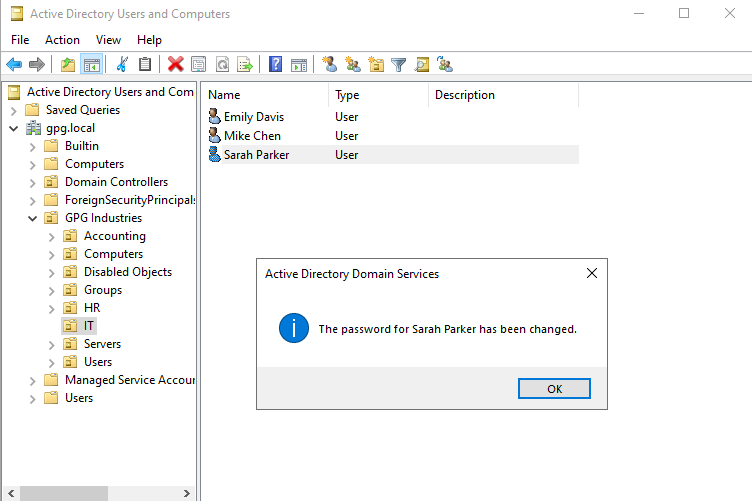
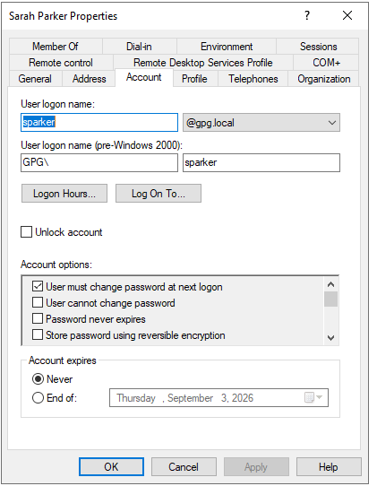
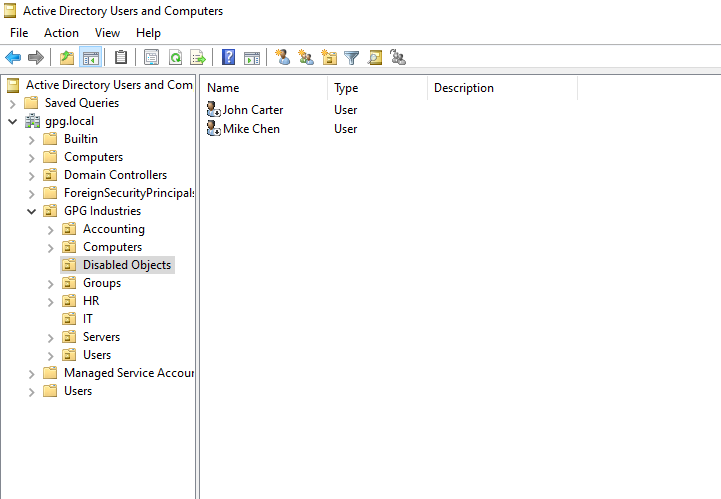
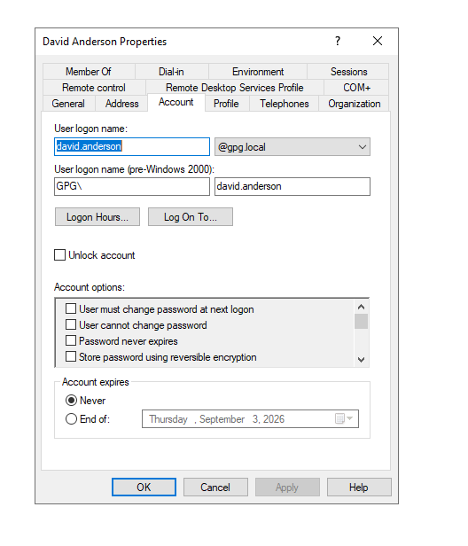

# Lab 008 - Active Directory Account Management

## 📖 Overview

In this lab, I performed common Active Directory account administration tasks that are typically handled by a Help Desk or Systems Administrator. These tasks included resetting passwords, managing disabled accounts, restoring user access, configuring password settings, and reviewing account properties.

---

# 🎯 Objectives

- Reset user passwords
- Force password changes at next logon
- Disable user accounts
- Enable user accounts
- Move users between Organizational Units (OUs)
- Configure password policies
- Review Active Directory account properties

---

# 🏢 Business Scenario

GPG Industries receives several account management requests from employees.

As the Help Desk Technician, I was responsible for:

- Resetting forgotten passwords
- Requiring password changes at next sign-in
- Disabling terminated employee accounts
- Restoring disabled user accounts
- Configuring password policies
- Verifying user account settings

---

# 🖥️ Lab Environment

| Component | Value |
|-----------|-------|
| Hypervisor | VMware Workstation |
| Operating System | Windows Server 2022 Standard Evaluation |
| Domain Controller | GPG-DC01 |
| Domain | gpg.local |
| Tool | Active Directory Users and Computers |

---

# 🛠️ Technologies Used

- Windows Server 2022
- Active Directory Domain Services
- Active Directory Users and Computers
- VMware Workstation
- Windows Authentication

---

# ⚙️ Implementation

## Step 1 — Reset User Password

- Reset Sarah Parker's password
- Assigned a temporary password
- Forced a password change at the next logon

---

## Step 2 — Disable User Account

- Disabled Mike Chen's Active Directory account

---

## Step 3 — Move Disabled Account

- Moved Mike Chen into the **Disabled Objects** Organizational Unit

---

## Step 4 — Restore User Account

- Re-enabled Mike Chen's account
- Moved the account back into the IT Organizational Unit

---

## Step 5 — Configure Password Policy

- Enabled **Password Never Expires** for David Miller

---

## Step 6 — Review Account Properties

Reviewed available account management options including:

- Account expiration
- Password options
- Logon restrictions
- Account status

---

# 💻 Administrative Tasks Performed

- Password Reset
- Account Disable
- Account Enable
- User Relocation
- Password Policy Configuration
- Account Property Review

---

# ✅ Verification

Successfully verified:

- Password reset completed
- Password change required at next logon
- Disabled account moved successfully
- User restored successfully
- Password policy updated
- Active Directory reflected all changes correctly

---

# 📸 Screenshots

### 1. Reset Password

---

### 2. Account Properties

---

### 3. Disabled User

---

### 4. Disabled Objects OU

---

### 5. Enabled User

---

### 6. Restored User

---

### 7. Password Never Expires

---

### 8. Account Properties Review

---

# 🧠 Lessons Learned

- Active Directory simplifies centralized account management.
- Organizational Units help organize users by department.
- Disabled accounts should be retained instead of immediately deleted.
- Security policies can be applied consistently through Active Directory.
- Password management is one of the most common Help Desk responsibilities.

---

# 💼 Skills Demonstrated

- Active Directory Administration
- Windows Server 2022
- Identity and Access Management (IAM)
- User Lifecycle Management
- Password Administration
- Organizational Unit Management
- Help Desk Support
- Enterprise Account Management

---

# 🚀 Next Lab

**Lab 009 — Group Policy Objects (GPO)**

In the next lab, I will create and apply Group Policy Objects to manage user and computer settings across the domain, introducing centralized policy management within an enterprise Active Directory environment.
